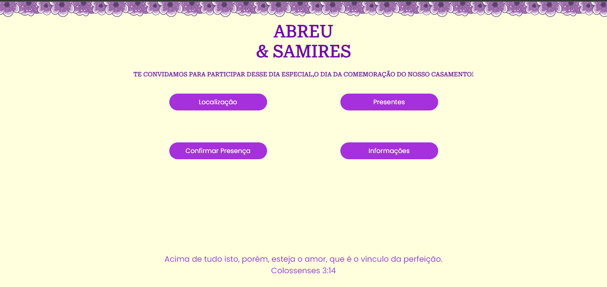
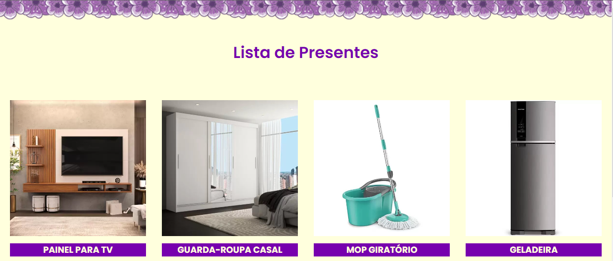
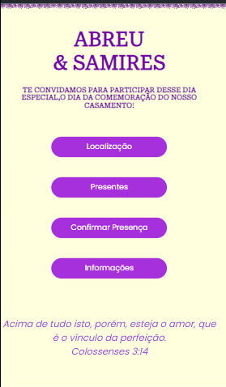
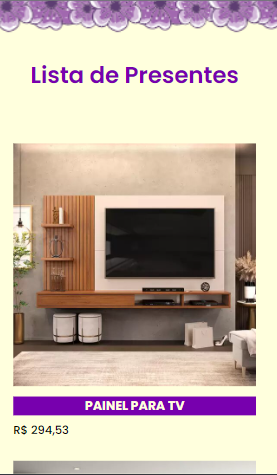

<h1 align="center">
     
    
</h1>

    <a href="#">Projeto</a>
 

# Convite Casamento 

Projeto Desenvolvido com a finalidade de compartilhar o convite do nosso casamento com nossos amigos e familiares

#### Funcionalidades

- Confirmação de Presença
- Informações sobre o dia
- Lista de Presentes
- Localização do espaço

## Tecnologias 🚀

Esse projeto foi desenvolvido com as seguintes tecnologias:

- [HTML](https://developer.mozilla.org/pt-BR/docs/Web/HTML/)
- [CSS](https://developer.mozilla.org/pt-BR/docs/Web/CSS)

## Layout 🚧

#### Desktop Screenshot

<!-- Responsive, 1440 x 900, 50% (Laptop L - 1440px)-->
    
    

#### Mobile Screenshot

<!-- Responsive, 425 x 900, 60% (Mobile L - 425px)-->
    
    

## Licença ⚖️

Este projeto está sob a licença do MIT. Veja o arquivo [LICENSE](https://github.com/NyctibiusVII/Happy/blob/master/LICENSE) para mais detalhes.

## Contato ✉️

 

   

